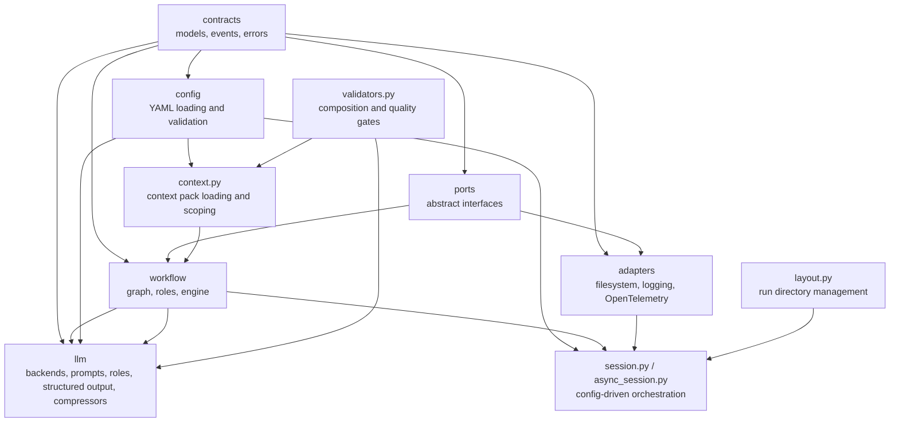

# pawc-kit

`pawc-kit` is a Python library for building multi-phase execution and review workflows with a stable public API, filesystem-backed default adapters, and a stable LLM integration namespace.

The supported public surface is:

- `pawc_kit`
- `pawc_kit.config`
- `pawc_kit.contracts`
- `pawc_kit.workflow`
- `pawc_kit.ports`
- `pawc_kit.adapters.fs`
- `pawc_kit.adapters.logging`
- `pawc_kit.adapters.otel`
- `pawc_kit.llm`

Maintainer notes on spec gaps and deferred features (discovery, context-pack write-side): [`docs/roadmap.md`](docs/roadmap.md).

## Install

Using `uv`:

```bash
uv sync --dev
```

Core dependencies include [**semver**](https://pypi.org/project/semver/) for SemVer 2.0 validation of skill/role and session version fields.

Optional extras:

- **OpenTelemetry** — metrics and tracing: `uv sync --dev --extra otel` or `pip install -e .[otel]`
- **Semantic compression** — [semantic-text-splitter](https://github.com/benbrandt/text-splitter) for chunk-based prompt compression: `uv sync --dev --extra semantic` or `pip install -e .[semantic]`

Requires Python 3.12+.

## Releases

The repo includes [python-semantic-release](https://python-semantic-release.readthedocs.io/)
configuration for SemVer bumps, [`CHANGELOG.md`](CHANGELOG.md), and `v*`
release tags based on conventional commits (see
[`CONTRIBUTING.md`](CONTRIBUTING.md)).

## Quick Start (config-driven)

The recommended way to run a workflow is via `WorkflowSession`, which reads
`config.yaml` and builds the workflow graph, engine policy, and directory
layout from it. Only role bindings and optional runtime objects (observer,
clock) are supplied in code.

**config.yaml**

```yaml
skill:
  name: my-skill
  version: "1.0.0"
state_directory: sessions

workflow:
  phases:
    - phase_id: work
      role_id: worker
      kind: executor
      on_complete: [review]
    - phase_id: review
      role_id: reviewer
      kind: review
      can_request_changes_from: [work]
  confidence_threshold: 85
  max_iterations: 10
  max_feedback_rounds: 3
  run_directory: sessions/execution
  state_filename: state.json

observability:
  observer: otel           # "otel" | "logging" | "none" (default: none)
  meter_name: pawc_kit.workflow   # for otel; ignored when observer != "otel"
  tracer_name: pawc_kit.workflow   # for otel; ignored when observer != "otel"
  logger_name: pawc_kit.workflow  # for logging; ignored when observer != "logging"
```

**Python**

```python
from pawc_kit import WorkflowSession

session = WorkflowSession.from_config("config.yaml")
session.register_role("worker", my_worker)
session.register_role("reviewer", my_reviewer)

state = session.run(session_id="run-001")
print(state.status)
```

Any `workflow.*` value can be overridden in code when needed:

```python
session = WorkflowSession.from_config(
    "config.yaml",
    confidence_threshold=90,   # override config value
    run_directory="sessions/custom",
)
```

`WorkflowSession.run()` is resumable — calling it again with the same
`session_id` picks up where it left off.

### Low-level engine usage

For full control over stores and paths, use `WorkflowEngine` directly:

```python
from pathlib import Path
from pawc_kit import WorkflowEngine
from pawc_kit.adapters.fs import FsArtifactStore, FsStateStore

run_dir = Path(".tmp") / "demo-run"
engine = WorkflowEngine(graph, FsStateStore(run_dir), FsArtifactStore(run_dir))
engine.register_role("worker", my_worker)
engine.register_role("reviewer", my_reviewer)

state = engine.run(
    session_id="session-1",
    skill_name="demo-skill",
    skill_version="0.1.0",
)
```

`WorkflowEngine` keeps the active session state in memory and only persists at commit points:

- run start
- phase transition
- iteration commit
- review commit
- finalize

You can pass a `ContextPack` into `session.run(context_pack=pack)` or `engine.run(context_pack=pack)`. The engine scopes it per phase via `PhaseDefinition.context_sources` and injects it into `ExecutionContext.context` and `ReviewContext.context` for roles.

## Stable API

### Config Infrastructure

- `load_yaml_config`, `load_root_config`, `load_role_config`
- `RootConfig`, `SkillConfig`, `ContextConfig`, `EfficiencyConfig`, `RoleConfig`
- `ContextInjectionConfig`, `CompressionConfig`, `ChunkPolicyConfig`
- `WorkflowSession`
- `LayoutManager`
- `ContextPack`, `load_context_pack`, `accessible_packs`
- `check_quality_gates`, `validate_composition`

### Contracts

- `SessionState`, `IterationEntry`, `ReviewEntry`, `ArtifactRef`
- `DecisionPayload`, `HandoffContext`

### Workflow

- `PhaseDefinition`, `PhaseGraph`
- `ExecutionContext`, `ReviewContext`
- `ExecutionResult`, `ReviewDecision`, `ReviewResult`
- `WorkflowEngine`, `AsyncWorkflowEngine`
- `Executor`, `Reviewer`, `AsyncExecutor`, `AsyncReviewer`

### Ports

- `StateStore`, `AsyncStateStore`
- `ArtifactStore`, `AsyncArtifactStore`
- `WorkflowObserver`, `AsyncWorkflowObserver`
- `Clock`, `AsyncClock`
- `ContextCompressor` — pluggable text compression for prompt injection

### Filesystem Adapters

- `FsStateStore`, `AsyncFsStateStore`
- `FsArtifactStore`, `AsyncFsArtifactStore`

## Generic Config Loading

The `config/` subpackage provides a generic YAML loader so that no consumer
needs to implement its own config processing:

```python
from pydantic import BaseModel
from pawc_kit import load_yaml_config

class RunnerConfig(BaseModel):
    max_retries: int = 3

# Flat config
cfg = load_yaml_config("my-config.yaml", RunnerConfig)

# Keyed config (e.g. runner-config.yaml with top-level "runner:" key)
cfg = load_yaml_config("runner-config.yaml", RunnerConfig, root_key="runner")
```

Convenience wrappers for PAWC-defined config types:

```python
from pawc_kit import load_root_config, load_role_config

root = load_root_config("config.yaml")           # -> RootConfig
role = load_role_config("worker/config.yaml")     # -> RoleConfig
```

## LLM Integrations

LLM helpers are available under the stable namespace:

```python
from pawc_kit.llm import MockBackend, LLMExecutorRole, LLMReviewerRole
```

### Context injection and compression

Context pack data (request files, discovery handoff, child packs) is injected into executor and reviewer prompts according to `RootConfig.context_injection` (`ContextInjectionConfig`). You control:

- **What to include** — `include_request_files`, `include_discovery`, `include_children`
- **Filtering** — `file_allowlist`, `file_blocklist`, `max_file_chars`, `discovery_sections`
- **Compression** — `compression.mode`: `"simple"` (default regex-based `MarkdownCompressor`), `"semantic"` (chunk → classify → policy → reassemble, requires `pawc-kit[semantic]`), or `"none"` (`PassthroughCompressor`)

With `mode: "semantic"`, per-chunk-type policies are configurable in YAML (`compression.policies`): `heading`, `paragraph`, `list`, `code`, `table`, `diagram`, each with `action` (`keep` / `truncate` / `collapse` / `strip`) and optional limits (`max_sentences`, `max_items`, `max_lines`, `max_rows`). The semantic pipeline uses [semantic-text-splitter](https://github.com/benbrandt/text-splitter) as the boundary oracle, then a heuristic classifier and your policies.

Implementations: `MarkdownCompressor`, `PassthroughCompressor`, `SemanticCompressor`; all implement the `ContextCompressor` protocol. The prompt builder resolves the compressor from config when building request and discovery sections; an explicit `compressor` argument overrides.

## Observability

`pawc_kit` emits immutable workflow events through the `WorkflowObserver` port. Built-in adapters are available for standard-library logging and OpenTelemetry.

### Config-driven observer selection

Set `observability.observer` in `config.yaml` to auto-construct an observer without writing any wiring code. The session resolves the observer with the following precedence:

1. Explicit `observer=SomeObserver()` kwarg wins.
2. Explicit `observer=None` suppresses the observer (even if config says `otel`).
3. Omitted kwarg -- auto-constructed from `config.observability` (default: `"none"`).

```yaml
observability:
  observer: otel     # "otel" | "logging" | "none"
```

The `otel` value requires `pawc-kit[otel]`. An explicit `observer=` kwarg on `WorkflowSession` / `AsyncWorkflowSession` always takes precedence.

### Logging adapter

```python
import logging

from pawc_kit.adapters.logging import LoggingWorkflowObserver

logging.basicConfig(level=logging.INFO)
logging.getLogger("pawc_kit.workflow").setLevel(logging.DEBUG)

observer = LoggingWorkflowObserver()
```

Level selection follows normal Python library conventions:

- configure `pawc_kit.workflow` to request lifecycle logs at `DEBUG`, `INFO`, `WARNING`, or `ERROR`
- configure `pawc_kit.llm` to include structured-output retry and failure logs
- the library installs a `NullHandler` on `pawc_kit` and never calls `basicConfig()`

Default logging adapter level mapping:

- `INFO`: `RunStarted`, `RunResumed`, successful `RunCompleted`
- `DEBUG`: `PhaseStarted`, `PhaseTransitioned`, `IterationCommitted`, approved `ReviewCommitted`
- `WARNING`: `ReviewCommitted` with `REQUEST_CHANGES`, abandoned `RunCompleted`
- `ERROR`: `RunFailed`

### OpenTelemetry adapter

Requires `pawc-kit[otel]`. Handles all 8 workflow event types with **metrics** (counters and histograms) and **traces** (nested spans).

```python
from pawc_kit.adapters.otel import OpenTelemetryWorkflowObserver

observer = OpenTelemetryWorkflowObserver(
    meter_name="pawc_kit.workflow",
    tracer_name="pawc_kit.workflow",
)
```

Span hierarchy (parent → child): **run** → **phase** → **iteration** / **review**.

| Span name | Created on | Ended on | Typical attributes |
|---|---|---|---|
| `pawc.workflow.run` | `RunStarted`, `RunResumed` | `RunCompleted`, `RunFailed` | `session_id`, `phase_id`, `resumed`, `skill_name` (when `RunStarted`); on completion: `run.status`, `run.feedback_loops` or `error.type` / `error.message` |
| `pawc.workflow.phase` | `PhaseStarted` | `PhaseTransitioned`, run end | `session_id`, `phase_id`, `role_id`, `phase_kind` |
| `pawc.workflow.iteration` | `IterationCommitted` | same event (duration from event timestamps) | `session_id`, `phase_id`, `iteration`, `confidence_score` |
| `pawc.workflow.review` | `ReviewCommitted` | same event (duration from event timestamps) | `session_id`, `phase_id`, `review`, `decision`, `confidence_score` |

Metrics emitted:

| Instrument | Type | Attributes | Event |
|---|---|---|---|
| `pawc.workflow.runs` | counter | `phase_id`, `outcome` | `RunStarted`, `RunCompleted` |
| `pawc.workflow.run_failures` | counter | `phase_id` | `RunFailed` |
| `pawc.workflow.iterations` | counter | `phase_id`, `outcome` | `IterationCommitted` |
| `pawc.workflow.reviews` | counter | `phase_id`, `outcome` | `ReviewCommitted` |
| `pawc.workflow.phases` | counter | `phase_id`, `phase_kind` | `PhaseStarted` |
| `pawc.workflow.transitions` | counter | `from_phase`, `to_phase` | `PhaseTransitioned` |
| `pawc.workflow.resumes` | counter | `phase_id`, `phase_kind` | `RunResumed` |
| `pawc.workflow.run.duration.seconds` | histogram | `outcome` | `RunCompleted` |
| `pawc.workflow.iteration.duration.seconds` | histogram | `phase_id` | `IterationCommitted` |
| `pawc.workflow.review.duration.seconds` | histogram | `phase_id` | `ReviewCommitted` |

Design notes:

- **Metrics:** low-cardinality attributes only; `session_id` is never included in metric labels.
- **Traces:** `session_id` is included on spans (expected for request-scoped traces and distinct from the metrics policy).
- **Threading:** the observer assumes single-threaded event delivery per session (same model as the default filesystem stores); span state is not locked.
- **Defensive behavior:** if events arrive without a parent span (e.g. `PhaseStarted` before `RunStarted`), child spans are still recorded as roots; duplicate `RunStarted` for the same session ends the previous run span before opening a new one.
- `AsyncOpenTelemetryWorkflowObserver` delegates to the sync observer (OTEL SDK calls are CPU-bound)

## Architecture

The public architecture is split into layers:



Execution wiring follows the same direction: config/session code builds the graph and
adapters, then hands execution to the workflow engine and role implementations.

1. `contracts` — pure data models and error types
2. `ports` — abstract interfaces (state, artifacts, observers, clock)
3. `workflow` — engine, phase graph, role protocols
4. `adapters` — filesystem and observability implementations
5. `config` — YAML config loading and validation infrastructure
6. `llm` — LLM backend integration (roles, structured output, prompts, context injection, compressors: `MarkdownCompressor`, `SemanticCompressor`, `PassthroughCompressor`)

Top-level modules bridge config with the engine:

- `session.py` — `WorkflowSession` orchestrator (config -> layout -> stores -> engine)
- `context.py` — context pack loading, resolution, scoping
- `layout.py` — run directory structure management
- `validators.py` — composition and quality-gate validation

## Development

Primary local workflow:

```bash
./scripts/verify.sh   # lint (fix), test, lint-check, type-check, test
```

Or run individual steps: `./scripts/lint.sh`, `./scripts/test.sh`, `./scripts/lint-check.sh`, `./scripts/type-check.sh`. Use `./scripts/commit.sh "type(scope): subject"` for commit message validation.

## License

Apache-2.0
