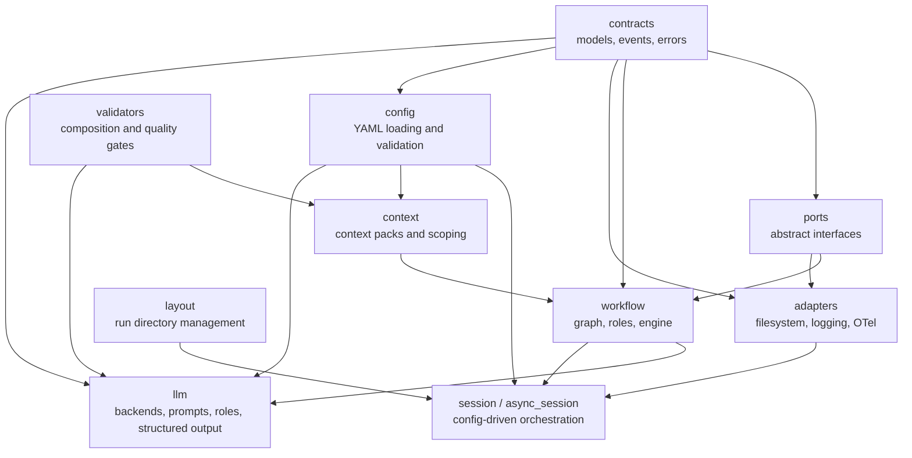

# pawc-kit architecture

This document describes how the **pawc-kit** Python library is layered and how execution, discovery, and configuration fit together. For field-by-field YAML reference, see [workflow-config-reference.md](workflow-config-reference.md). For HTTP services and transport, see the **pawc-server** repository.

Last updated: 2026-03-26

---

## Scope

**pawc-kit** provides:

- **Contracts** — Pydantic models for session state, config, discovery, events, and errors.
- **Ports** — Abstract interfaces (`StateStore`, `ArtifactStore`, observers, clock, runtime helpers).
- **Workflow** — Phase graph, synchronous and asynchronous engines, executor/reviewer protocols.
- **Adapters** — Default filesystem state/artifact stores (sync and async), logging and OpenTelemetry observers.
- **Config** — YAML loading and validation (`RootConfig`, `DiscoveryConfig`, `RoleConfig`, …).
- **LLM** — Backend protocols, structured output parsing/retries, prompt assembly, LLM-backed roles.
- **Context** — Context pack loading, composition checks, and scoping into execution/review contexts.

The **root package** (`import pawc_kit`) exposes only a small entry surface: `WorkflowSession`, `AsyncWorkflowSession`, config loaders, and `utc_now`. Everything else is imported from subpackages (`pawc_kit.contracts`, `pawc_kit.workflow`, …).

---

## Layer diagram

Dependency direction is top-down: upper layers depend on lower ones, not the reverse.

**Rough responsibilities**

1. **contracts** — Pure data and error types; no I/O.
2. **ports** — Interfaces the engine and session code depend on; implementations live in adapters or the host app.
3. **workflow** — `PhaseGraph`, `WorkflowEngine` / `AsyncWorkflowEngine`, role protocols (`Executor`, `Reviewer`, async variants).
4. **adapters** — Filesystem stores, workflow observers, compressors used from session/config wiring.
5. **config** — `load_root_config`, `load_role_config`, `load_yaml_config` and Pydantic validation.
6. **llm** — `LLMBackend` / `AsyncLLMBackend`, `StructuredOutput` / `AsyncStructuredOutput`, `LLMExecutorRole` / `LLMReviewerRole` (and async variants).
7. **session** — Builds layout, resolves stores from config, constructs the engine, registers roles.
8. **context** — Loads packs from disk, applies `PhaseDefinition.context_sources`, feeds prompt assembly.
9. **validators** — Composition and quality-gate checks used with context packs and LLM config.

Internal helpers (for example atomic file writes under `adapters/fs`) are not part of the stable API.

---

## Execution vs discovery configuration

- **Execution-style workflows** are driven by native `config.yaml` / `RootConfig`: `workflow.phases[]` with `PhaseDefConfig`. Typical entry point: `WorkflowSession.from_config(...)` or `AsyncWorkflowSession.from_config(...)`.
- **Discovery-style workflows** use `DiscoveryConfig` (different phase shape: `phase:` / `on_complete:`). The graph is usually built with `PhaseGraph.from_discovery_config`. Servers and CLIs load discovery YAML separately from the root skill config; see [workflow-config-reference.md](workflow-config-reference.md) and [templates/README.md](../templates/README.md).

The same **engine** can run either graph shape once the `PhaseGraph` is built; the difference is config schema and who loads it.

---

## Async vs sync

- **Sync:** `WorkflowEngine`, `WorkflowSession`, `FsStateStore`, `LLMBackend`, `StructuredOutput`.
- **Async:** `AsyncWorkflowEngine`, `AsyncWorkflowSession`, `AsyncFsStateStore`, `AsyncLLMBackend`, `AsyncStructuredOutput`.

Use async when integrating with asyncio runtimes (for example Starlette/FastAPI or async state stores).

---

## Observability

Workflow progress is emitted as immutable **events** (`RunStarted`, `PhaseStarted`, `IterationCommitted`, …). Implement `WorkflowObserver` / `AsyncWorkflowObserver` or use `LoggingWorkflowObserver` / `OpenTelemetryWorkflowObserver` from `pawc_kit.adapters`. Session config can select an observer via `observability.observer` in YAML.

---

## Related documents

| Document | Purpose |
|----------|---------|
| [workflow-config-reference.md](workflow-config-reference.md) | Every `RootConfig` field and session behaviour |
| [llm-backend-research.md](llm-backend-research.md) | Notes on LLM provider behaviour (research) |
| [templates/README.md](../templates/README.md) | Index of example YAML templates |
| Repository `README.md` | Install, quick start, stable API index, OTel tables |
